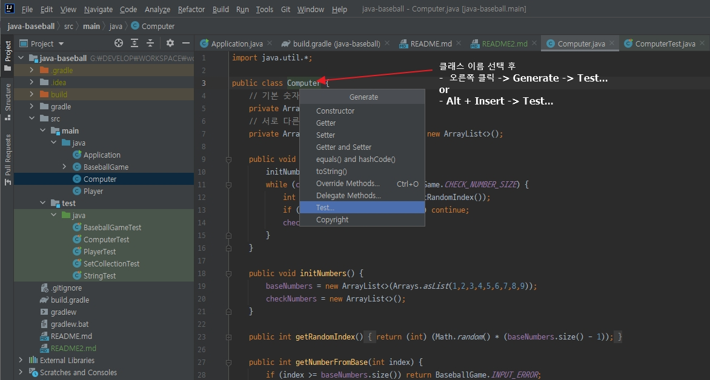
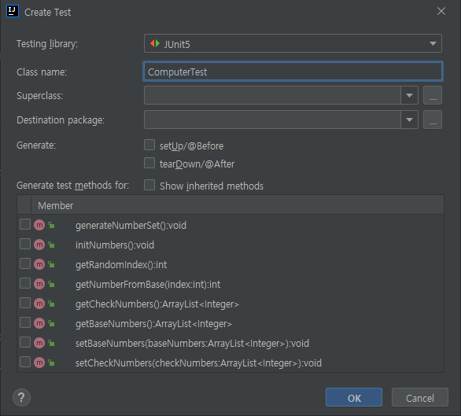
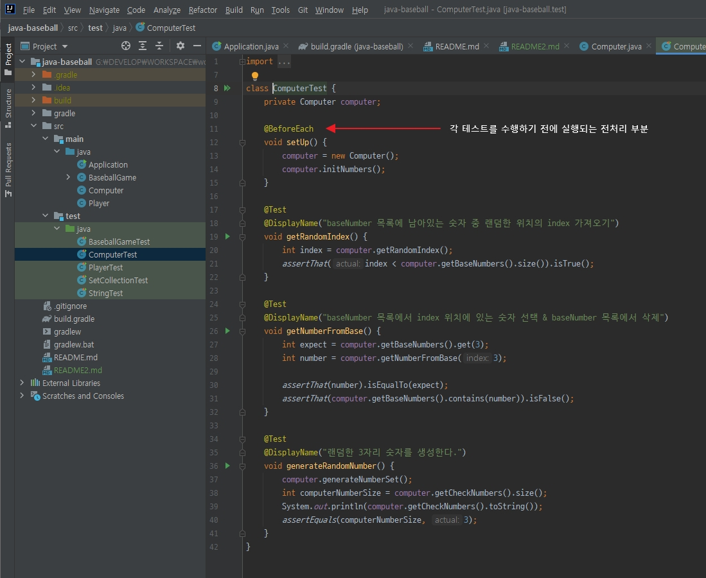

# UNIT TEST
## 준비
### Gradle
1. gradle dependency 추가
- build.gradle
```
dependencies {
    testCompile('org.junit.jupiter:junit-jupiter:5.5.2')
    testCompile('org.assertj:assertj-core:3.14.0')
}
```

2. 보통 UI 관련 없이 오로지 비지니스 로직만이 있는 클래스에 대해 테스트 코드 작성
- 예시는 Computer Class
  1. 테스트 코드 작성할 클래스에서 유닛 테스트 파일 생성
    - 
     
  2. 원하는 테스트 함수 선택하면 자동으로 해당하는 빈 테스트 함수가 생성됨
    - 
    
  3. 전처리 부분이 필요하면 작성하고 각각 개별 테스트 코드 작성해서 테스트 실행
    - 
    
3. 각 테스트는 테스트 하려는 클래스의 함수를 통해 예상되는 결과값을 받고 assertThat 이나 비교할 수 있는
   다른 명령어를 통해 예상값과 직접 입력한 기대값을 비교하여 작성된 함수가 원하는 대로 잘 작동하는지 확인한다.